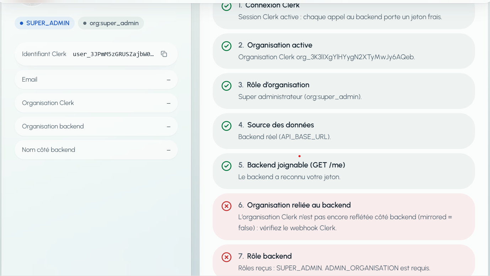
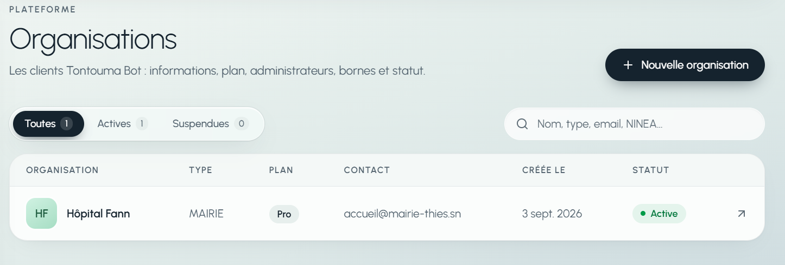
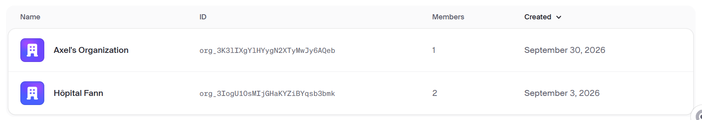
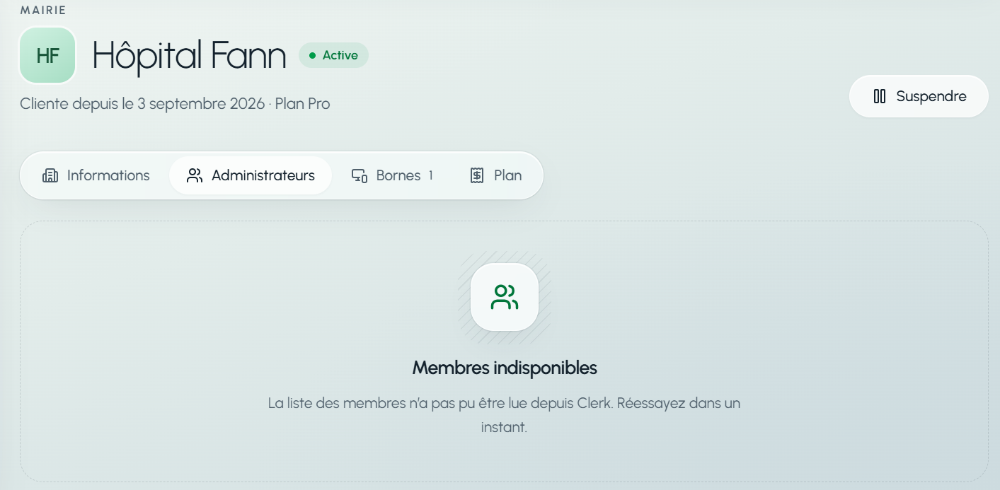
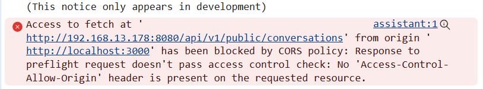
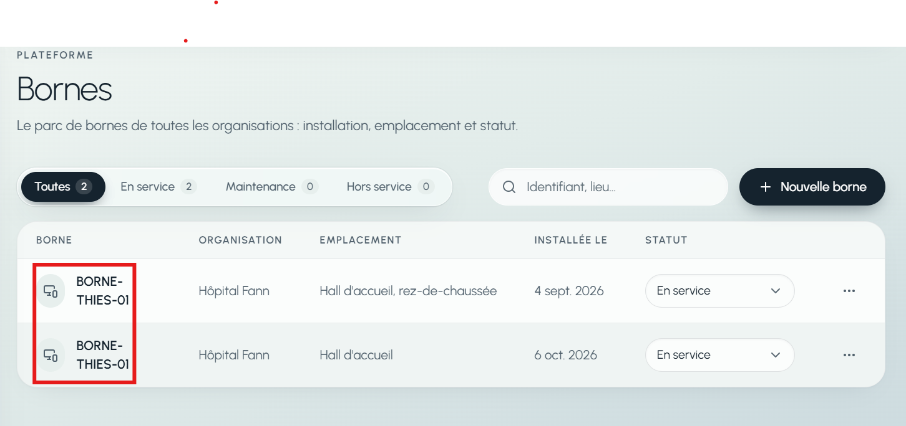
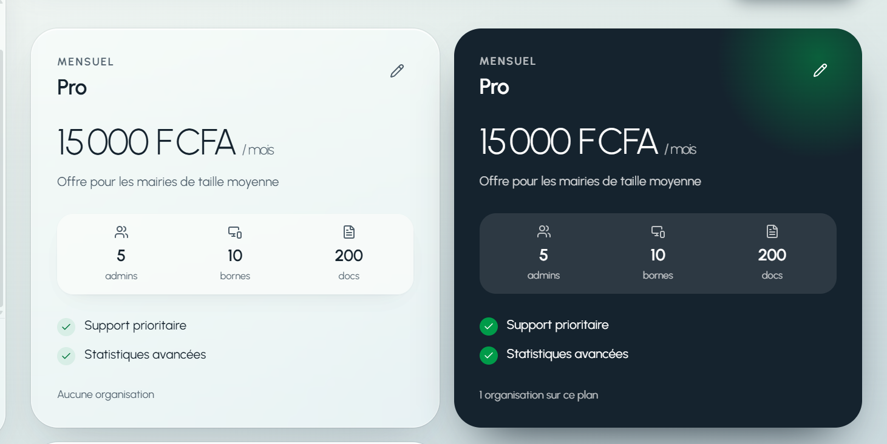

# Retour d'intégration du dashboard — points à corriger côté backend


- **Backend testé :** `http://192.168.13.178:8080` (70 endpoints exposés par `/v3/api-docs`)
- **Compte utilisé :** `user_3JPmM5zGRUSZajbW0g6NCA3vUcA`, `public_metadata.role = SUPER_ADMIN`, membre `org:super_admin` de l'organisation Clerk `org_3K3lIXgYlHYygN2XTyMwJy6AQeb`

Toutes les réponses ci-dessous sont les réponses réelles du backend, copiées telles quelles. Les données de test créées (plans et bornes « TEST ») ont été supprimées.

## Résumé

| # | Problème | Gravité | Ce que ça bloque |
|---|---|---|---|
| 1 | Le backend ne lit pas l'organisation ni le rôle d'organisation dans le jeton Clerk | Bloquant | Tout l'espace organisation (`/api/v1/admin/...`) |
| 2 | Une organisation créée dans Clerk n'existe pas dans la base backend | Bloquant | Idem, pour mon organisation de test |
| 3 | `CLERK_SECRET_KEY` non configurée sur le backend | Bloquant | Membres, invitation et retrait d'admin, création d'organisation |
| 4 | CORS : `http://localhost:3000` refusé | Bloquant | Chat de l'assistant et envoi de documents |
| 5 | Réponses de création incomplètes (dates et identifiants à `null`) | Moyen | Contourné côté dashboard |
| 6 | Deux bornes peuvent avoir le même identifiant | Moyen | Qualité des données |
| 7 | Trois plans identiques « Pro » en base | Faible | Affichage des plans |
| 8 | L'assistant répond en 16 à 44 secondes | À discuter | Confort des citoyens |

Ce qui fonctionne déjà : les 12 endpoints publics, le chatbot (texte, voix, historique, audio), le refus `401` sans jeton sur les 57 routes protégées, et la lecture / modification / suppression des plans et des bornes en SUPER_ADMIN.

---

## 1. Le backend ne lit pas l'organisation dans le jeton Clerk

**Ce que j'observe.** Avec un jeton valide, `GET /api/v1/me` répond 200 mais ne renvoie ni organisation, ni email, ni rôle d'organisation :

```json
{
  "clerkUserId": "user_3JPmM5zGRUSZajbW0g6NCA3vUcA",
  "roles": ["SUPER_ADMIN"],
  "mirrored": false
}
```

Champs absents : `email`, `clerkOrgId`, `organizationId`, `organizationName`. Rôle absent : `ADMIN_ORGANISATION`.

**Ce que contient pourtant le jeton envoyé.** C'est le jeton de session standard de Clerk (version 2), celui que renvoie `getToken()` :

```json
{
  "sub": "user_3JPmM5zGRUSZajbW0g6NCA3vUcA",
  "o": {
    "id": "org_3K3lIXgYlHYygN2XTyMwJy6AQeb",
    "rol": "super_admin",
    "slg": "axel-s-organization-1790794017986521229"
  },
  "public_metadata": { "role": "SUPER_ADMIN" },
  "platform_role": "SUPER_ADMIN",
  "v": 2
}
```

**Explication simple.** Dans le jeton Clerk version 2, l'organisation n'est pas dans `org_id` / `org_role`. Elle est dans l'objet `o` : `o.id` pour l'identifiant, `o.rol` pour le rôle (sans le préfixe `org:`). Le backend trouve bien `public_metadata.role`, mais il ne trouve pas l'organisation, donc il ne donne jamais le rôle `ADMIN_ORGANISATION`.

**Preuve : même compte, même session, deux modèles de jeton.**

| | Jeton standard (envoyé par le dashboard) | Modèle Clerk `backend-test` |
|---|---|---|
| Organisation dans le jeton | `o.id`, `o.rol` | `org_id`, `org_role` |
| Email dans le jeton | absent | `email` |
| `GET /me` → `roles` | `["SUPER_ADMIN"]` | `["ADMIN_ORGANISATION", "SUPER_ADMIN"]` |
| `GET /me` → `clerkOrgId` | absent | `org_3K3lIXgYlHYygN2XTyMwJy6AQeb` |
| `GET /me` → `email` | absent | présent |
| `GET /admin/services` | 403 « rôle insuffisant pour cette ressource » | 403 « Organisation Clerk inconnue en base » (voir point 2) |

Le backend lit donc `org_id`, `org_role` et `email`, qui n'existent que dans le modèle `backend-test`.

**Conséquence.** Tous les endpoints `/api/v1/admin/...` sont inaccessibles depuis le dashboard, quel que soit l'utilisateur.

**Ce que je demande.** Une de ces deux options, à toi de choisir :

- **Option A (préférée) :** le backend lit aussi `o.id` et `o.rol` dans le jeton de session standard. Correspondance des rôles : `super_admin` et `admin` donnent tous les deux `ADMIN_ORGANISATION`. C'est le jeton que Clerk fournit par défaut, sans réglage supplémentaire.
- **Option B :** on garde le modèle `backend-test` et je modifie le dashboard pour l'envoyer à chaque appel. Dans ce cas il faut lui donner un nom définitif (ce n'est plus un test) et le recréer à l'identique dans l'instance Clerk de production.

Dans les deux cas, dis-moi laquelle tu choisis pour qu'on fasse la même chose des deux côtés.

**Capture :** la page « Mon compte » du dashboard, étapes 6 et 7 en rouge.



---

## 2. Une organisation créée dans Clerk n'existe pas côté backend

**Ce que j'observe.** Clerk contient deux organisations : « Hôpital Fann » et « Axel's Organization » (`org_3K3lIXgYlHYygN2XTyMwJy6AQeb`). `GET /api/v1/superadmin/organizations` n'en renvoie qu'une seule : Hôpital Fann. Et `GET /me` répond `"mirrored": false` pour la mienne.

**Ce que je demande.**

- Comment une organisation créée dans Clerk doit-elle arriver dans ta base ? Par le webhook `POST /webhooks/clerk` ? Est-il configuré dans Clerk et joignable depuis Internet (ton backend est sur une adresse locale `192.168.x.x`) ?
- En attendant, peux-tu relier à la main `org_3K3lIXgYlHYygN2XTyMwJy6AQeb` pour que je teste l'espace organisation ?

**Capture :** la liste `/admin/organisations` du dashboard (une seule ligne) à côté de la liste des organisations dans Clerk (deux lignes).





---

## 3. `CLERK_SECRET_KEY` non configurée sur le backend

**Requête 1.**

```
GET /api/v1/superadmin/organizations/12d1b61e-6c37-43ba-b7ba-4743c0176736/members
```

```json
{
  "timestamp": "2026-10-06T12:20:58.979840700Z",
  "status": 502,
  "error": "Bad Gateway",
  "message": "Clé secrète Clerk non configurée (CLERK_SECRET_KEY).",
  "path": "/api/v1/superadmin/organizations/12d1b61e-6c37-43ba-b7ba-4743c0176736/members"
}
```

**Requête 2.**

```
DELETE /api/v1/superadmin/organizations/12d1b61e-6c37-43ba-b7ba-4743c0176736/admins/user_inconnu_test
```

Même réponse : `502`, « Clé secrète Clerk non configurée (CLERK_SECRET_KEY). »

**Explication simple.** Pour lister les membres ou inviter quelqu'un, le backend doit appeler Clerk, et il lui faut la clé secrète de l'instance Clerk. Elle n'est pas renseignée dans la configuration du backend qui tourne.

**Conséquence.** Membres, invitation d'admin et retrait d'admin ne marchent pas. Je n'ai pas testé la création d'organisation ni l'invitation (elles envoient un vrai email), mais elles appellent Clerk aussi et échoueront sûrement de la même façon.

**Ce que je demande.** Renseigner `CLERK_SECRET_KEY` (clé de la même instance Clerk que le dashboard : `possible-peacock-3808.clerk.accounts.dev`) et redémarrer le backend.

**Capture :** dans le dashboard, `/admin/organisations` → Hôpital Fann → bloc des membres en erreur.



---

## 4. CORS : le dashboard est refusé par le backend

**Ce que j'observe.** Même endpoint, deux origines différentes :

| Origine envoyée | Réponse |
|---|---|
| `http://localhost:3000` (le dashboard) | `HTTP 403`, pas d'en-tête `Access-Control-Allow-Origin` |
| `http://localhost:5173` | `HTTP 200`, `Access-Control-Allow-Origin: http://localhost:5173` |

**Pour le reproduire toi-même :**

```bash
curl -i -X OPTIONS -H "Origin: http://localhost:3000" -H "Access-Control-Request-Method: POST" http://192.168.13.178:8080/api/v1/public/conversations
```

**Explication simple.** Quand une page web appelle le backend directement, le navigateur demande d'abord au backend s'il accepte les appels venant de cette adresse. Aujourd'hui il ne dit oui qu'à `localhost:5173`. Le dashboard tourne sur `localhost:3000`, donc le navigateur bloque l'appel.

**Conséquence.** Deux fonctions partent directement du navigateur et sont bloquées :

- le chat de l'assistant (`POST /api/v1/public/conversations` et ses messages) ;
- l'envoi de documents (`POST /api/v1/admin/knowledge-documents/upload`).

**Ce que je demande.** Ajouter aux origines autorisées :

- `http://localhost:3000` maintenant ;
- le domaine de production du dashboard quand il sera connu.

Méthodes : `GET, POST, PUT, DELETE, OPTIONS`. En-têtes : `Authorization`, `Content-Type`.

**Capture :** dans le navigateur, F12 → onglet Console, après l'envoi d'une question sur la page Assistant (ligne rouge « blocked by CORS policy »).



---

## 5. Réponses de création incomplètes

Le backend enregistre correctement, mais la réponse renvoyée juste après est incomplète. La lecture (`GET`) du même objet, elle, est complète.

**5a. `POST /api/v1/superadmin/plans` → 201, dates à `null`**

```json
{
  "id": "77e83f69-9059-432f-b67c-11befa460e2a",
  "name": "TEST – à supprimer 122100",
  "amount": 10000,
  "currency": "XOF",
  "billingPeriod": "MOIS",
  "active": true,
  "features": [{ "id": "8be99627-3953-4ada-9f1b-f66820add7d0", "label": "Fonction de test", "displayOrder": 0 }],
  "createdAt": null,
  "updatedAt": null
}
```

**5b. `PUT /api/v1/superadmin/plans/{id}` → 200, identifiant de fonctionnalité à `null`**

```json
{
  "id": "77e83f69-9059-432f-b67c-11befa460e2a",
  "amount": 15000,
  "features": [{ "id": null, "label": "Fonction de test", "displayOrder": 0 }],
  "createdAt": "2026-10-06T12:20:59.166217Z",
  "updatedAt": "2026-10-06T12:20:59.166217Z"
}
```

`updatedAt` n'a pas bougé non plus dans cette réponse, alors que le `GET` suivant renvoie `2026-10-06T12:20:59.241731Z`.

**5c. `POST /api/v1/superadmin/bornes` → 201, sans `createdAt` ni `updatedAt`**

```json
{
  "id": "ef906730-aab5-419a-a528-86c6bc51c00a",
  "organizationId": "12d1b61e-6c37-43ba-b7ba-4743c0176736",
  "identifier": "TEST-BORNE-122100",
  "location": "Hall de test",
  "status": "MAINTENANCE"
}
```

**Explication simple.** La réponse est construite avant que la base ait rempli les dates et les identifiants générés. Il faut relire l'objet (ou forcer l'écriture) avant de le renvoyer.

**Conséquence.** Le dashboard refusait ces réponses et affichait une erreur alors que la création avait réussi. Je l'ai contourné de mon côté (il accepte maintenant ces champs vides), donc ce n'est plus bloquant, mais la réponse reste fausse. Le même défaut existe peut-être sur les autres créations (services, démarches, départements) : je n'ai pas pu les tester à cause du point 1.

**Ce que je demande.** Que les réponses `POST` et `PUT` renvoient le même contenu que le `GET` correspondant.

---

## 6. Deux bornes peuvent avoir le même identifiant

J'ai envoyé deux fois exactement la même requête :

```
POST /api/v1/superadmin/bornes
{ "organizationId": "12d1b61e-6c37-43ba-b7ba-4743c0176736", "identifier": "TEST-BORNE-122100", "location": "Hall de test", "status": "MAINTENANCE" }
```

Les deux fois : `HTTP 201`, avec deux `id` différents (`ef906730-…` puis `1df6fc0d-…`) et le même `identifier`.

**Explication simple.** L'identifiant d'une borne sert à la reconnaître sur le terrain. Deux bornes avec le même identifiant, c'est une source d'erreurs. Le contrat prévoit d'ailleurs une réponse `409` sur cet endpoint.

**Ce que je demande.** Refuser le doublon avec un `409` et un message clair (unicité au moins par organisation).

**Capture :** dans le dashboard, `/admin/bornes`, après avoir créé deux bornes avec le même identifiant : les deux lignes apparaissent.



---

## 7. Trois plans identiques « Pro »

`GET /api/v1/superadmin/plans` renvoie :

| Nom | Prix | Identifiant | Créé le |
|---|---|---|---|
| Pro | 15 000 XOF / mois | `303af773-7a7a-4178-874b-fd2a58b9ac16` | 2 septembre 2026 |
| Pro | 15 000 XOF / mois | `74384776-64ee-467b-bd5e-c3fff0b444c1` | 3 septembre 2026 |
| Pro | 15 000 XOF / mois | `cc66ede5-cbf3-4054-9975-956005a559e8` | 9 septembre 2026 |

Hôpital Fann utilise le deuxième (`74384776-…`).

**Ce que je demande.** Supprimer les deux plans inutilisés, et dire si deux plans peuvent porter le même nom. Si non, renvoyer un `409` à la création.

**Capture :** la page `/admin/plans` du dashboard avec les trois cartes « Pro ».



---

## 8. Temps de réponse de l'assistant

Mesures sur `POST /api/v1/public/conversations/{id}/messages`, organisation Hôpital Fann :

| Question | Durée totale |
|---|---|
| Texte, sans voix | 26 secondes |
| Texte, avec réponse vocale | 44 secondes |
| Question vocale (1 seconde d'audio) | 16 secondes |

Les réponses sont correctes et sourcées. Mais le texte arrive en 2 ou 3 gros blocs à la fin, pas mot par mot : le citoyen attend longtemps devant un écran vide.

**Ce que je demande.** Savoir si c'est normal sur ta machine de dev, et si le texte peut être envoyé au fur et à mesure.

---

## Ce que je n'ai pas pu tester

- Les 32 endpoints `/api/v1/admin/...` : bloqués par les points 1 et 2.
- Création, modification, changement de plan, suspension d'une organisation et invitation d'un admin : il n'y a pas d'endpoint pour supprimer une organisation de test, et je n'ai pas voulu modifier Hôpital Fann.
- `GET /api/v1/public/procedures/{id}/form` avec un vrai formulaire : aucun formulaire publié n'existe.

## Ordre conseillé

1. Point 3 (clé Clerk) et point 4 (CORS) : de la configuration, rapide.
2. Point 1 (lecture du jeton) puis point 2 (organisation reliée) : ils débloquent tout l'espace organisation.
3. Points 5, 6 et 7 : corrections de qualité.
4. Point 8 : à discuter.
